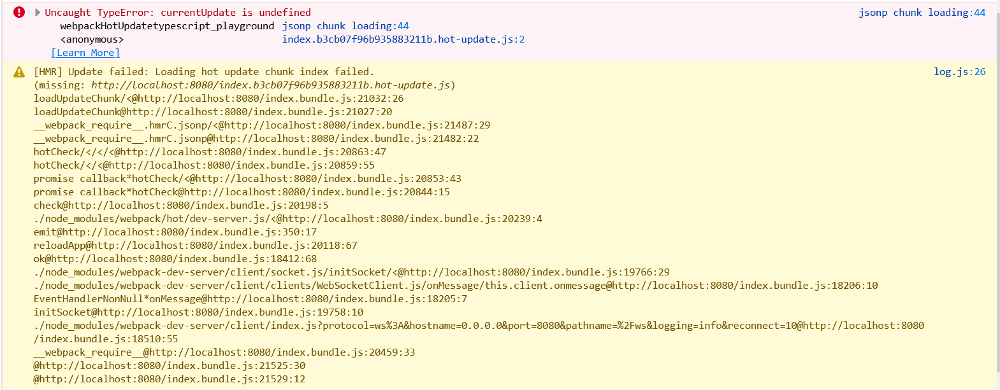

# `currentUpdate is undefined` reproducible repo

This repo should reproduce the bug reported in [webpack/webpack#14873](https://github.com/webpack/webpack/discussions/14873) with the correct environment.

## Environment

Note: This environment is my environment where I observed the bug to occur, it isn't to say it's the only or most correct environment to reproduce the bug.

* Windows 10 (latest as of March 27th, 2022)
* Node v15.5.1
* Yarn v1.22.15
* Firefox 98.0.2 (64-bit)
* `webpack` 5.70.0
* `webpack-cli` 4.9.2
* `webpack-dev-server` 4.7.4
* `html-webpack-plugin` 5.5.0
* `lodash` 4.17.21

## Steps to Reproduce

**NOTE:** I've observed this isn't always deterministic. If you don't observe the error, stop the server and try again with another `yarn start`. Error seems to occur more often than not.

1. Clone repo
2. Run `yarn start`
3. Visit <http://localhost:8080/>
4. Open web developer console and observe everything is looking OK
5. Edit `src/index.js:9` and replace the string `'changeme'` with `'changed'` and save
6. Observe the error:

```
Uncaught TypeError: currentUpdate is undefined
    webpackHotUpdatetypescript_playground jsonp chunk loading:44
    <anonymous> index.b3cb07f96b935883211b.hot-update.js:2
```



**NOTE:** appending or prepending to the string array does *not* reproduce the the error. The value of a pre-existing string must be changed.

## Other Reproducible Actions

* Add a `console.log("foo");` after line 15
* Changing the string in `btn.innerHTML` on line 12
